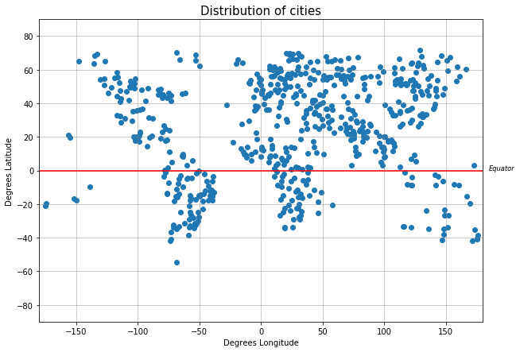
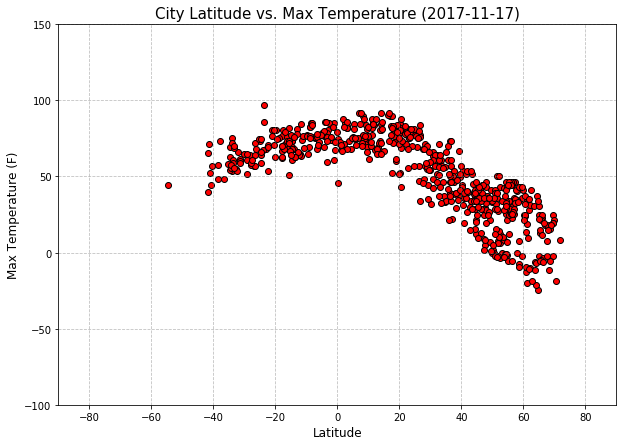
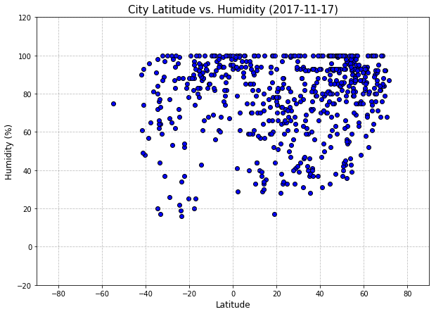
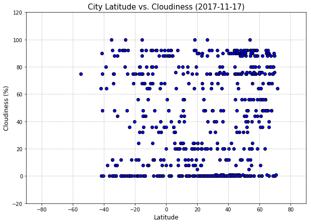
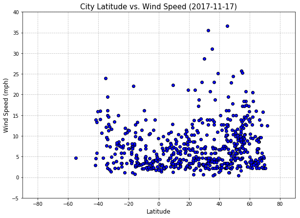

# WeatherPy
### Analysis
* Data is biased towards the northern hemisphere due to greater landmass and therefore more cities.
* Lower latitude negatively coorelates with higher temperatures.  As the latitude decreases, temperature increases.
* Humidity and cloudiness do not coorelate with latitude.  A range of humidities and cloudiness can be found accross all latitudes.
* There appears to be a weak positive correlation between wind speed and latitude.  Higher latitudes have moderately increased wind speed, however further analysis would be necessary to draw a stronger conclusion.


### Packages
Notes:
* openweathermapy - OpenWeatherMap API wrapper
* config - OpenWeatherMap API key
* citipy - finds nearest city for a set of geo coordinates
* geopy - geocoding toolset, using for distance calculations between coordinates
```python
import json
import requests
import csv
import random
import time
import pandas as pd
import openweathermapy.core as owm
import matplotlib.pyplot as plt
from config import *
from citipy import citipy
from geopy.distance import vincenty
```


```python
#OpenWeatherMap Settings
owm_settings = {"units": "imperial", "appid": api_key}

#Load OWM city list json file
owm_city_json = json.load(open('city.list.json', encoding='utf8'))
```

## Generate random list of unique cities
Creates random coordinates and then uses citipy to pull nearest city.  Runs check against OpenWeatherMap city list to ensure OWM has data available.  Also grabs city coordinates for distance check.  Using vincenty formula from geopy to calculate distance between random coordinate and nearest city.  If distance is greater than 69 miles then city is not added to the generated city list.  Using 69 miles as cutoff since this is roughly the distance between each degree of latitude or longitude at the equator.  Helps to avoid data points which initially fall in empty zones (i.e. oceans).
NOTE: Using vincenty instead fo great circle due to greater accuracy.  Vincenty can return incorrect results with antipodal points however in this application no random coordinate will have its nearest city as an antipode.

```python
city_count = 600
counter = 0

rangeLat = (-90, 90)
rangeLong = (-180, 180)

latitudes = []
longitudes = []

cities = []

print('Randomly selecting 600 cities...')
while counter != city_count:
    rand_lat = round(random.uniform(*rangeLat), 5)
    rand_long = round(random.uniform(*rangeLong), 5)
    rand_coord = (rand_lat, rand_long)
    city = citipy.nearest_city(rand_lat, rand_long)
    name = city.city_name
    country = city.country_code
    
    city_coord = ''
    for x in owm_city_json:
        if x['name'] == name.title() and x['country'] == country.upper():
            city_coord = (x['coord']['lat'], x['coord']['lon'])
            owm_id = x['id']
            lat = x['coord']['lat']
            long = x['coord']['lon']
            
    if city_coord != '' and owm_id not in cities:
        distance = vincenty(rand_coord, city_coord).miles #using vincenty since it's more accurate than great_circle, errors when handling antipodes is not an issue here since the closest city to any given coord will not be an antipode
        if distance <= 69: #at equator, each line of latitude is approximately 69 miles from the next line, same for longitude.  Eliminating random points that have no nearby city within one degree of lat/long
            cities.append(owm_id)
            counter = counter + 1

            latitudes.append(lat)
            longitudes.append(long)

            
print('...selection complete')
```


    

### Cache generated city list
```python
#Export generated city list to csv
with open('my_city.list.csv', 'w') as fileout:
    writer = csv.writer(fileout, delimiter=',')
    writer.writerow(cities)
```

### Plot city locations to check for possible clusters
```python
plt.figure(figsize=(10,7))

plt.scatter(longitudes, latitudes)
plt.title('Distribution of cities', size='15')
plt.xlim(-180, 180)
plt.xlabel('Degrees Longitude')
plt.ylim(rangeLat)
plt.ylabel('Degrees Latitude')
plt.axhline(y=0, color='r', linestyle='-')
plt.text(185,0,'Equator', size='smaller', style='italic')
plt.grid(color='grey', alpha=0.5)
plt.show()
```





## Retrieve city specific weather data from OpenWeatherMap
```python
counter = 1
data = []

print('---------------------------------\nBeginning Data Retrieval\n---------------------------------')
for city in cities:
    current_weather = owm.get_current(int(city), **owm_settings)
    data.append(current_weather)
    print(f'Processing record {"{0:>3s}".format(str(counter))} of {len(cities)} | {current_weather["name"]}, {current_weather["sys"]["country"]}')
    counter = counter + 1
    time.sleep(1)
    
print('---------------------------------\nData Retrieval Complete\n---------------------------------')
```

    ---------------------------------
    Beginning Data Retrieval
    ---------------------------------
    Processing record   1 of 600 | Lyngseidet, NO
    Processing record   2 of 600 | Sharjah, AE
    Processing record   3 of 600 | Bonfim, BR
    Processing record   4 of 600 | Dubreka, GN
    Processing record   5 of 600 | Cootamundra, AU
    Processing record   6 of 600 | Chiang Khong, TH
    Processing record   7 of 600 | Big Bend, SZ
    Processing record   8 of 600 | Prince Albert, CA
    Processing record   9 of 600 | Batagay-Alyta, RU
    Processing record  10 of 600 | Dachau, DE
    Processing record  11 of 600 | La Orilla, MX
    Processing record  12 of 600 | Tarnow, PL
    Processing record  13 of 600 | Urusha, RU
    Processing record  14 of 600 | Dengfeng, CN
    Processing record  15 of 600 | Moroni, KM
    Processing record  16 of 600 | Kurilsk, RU
    Processing record  17 of 600 | Contamana, PE
    Processing record  18 of 600 | Smithers, CA
    Processing record  19 of 600 | Vaini, TO
    Processing record  20 of 600 | Carmelo, UY
    Processing record  21 of 600 | Awbari, LY
    Processing record  22 of 600 | Dejen, ET
    Processing record  23 of 600 | Fuerte Olimpo, PY
    Processing record  24 of 600 | Malanje, AO
    Processing record  25 of 600 | Naudero, PK
    Processing record  26 of 600 | Aloja, LV
    Processing record  27 of 600 | Carauari, BR
    Processing record  28 of 600 | Naze, JP
    Processing record  29 of 600 | Zverinogolovskoye, RU
    Processing record  30 of 600 | Lakhdenpokhya, RU
    Processing record  31 of 600 | Tiznit, MA
    Processing record  32 of 600 | Uglegorsk, RU
    Processing record  33 of 600 | Toora-Khem, RU
    Processing record  34 of 600 | Ushuaia, AR
    Processing record  35 of 600 | Vyazemskiy, RU
    Processing record  36 of 600 | Rugby, GB
    Processing record  37 of 600 | Aasiaat, GL
    Processing record  38 of 600 | Uarini, BR
    Processing record  39 of 600 | Tahe, CN
    Processing record  40 of 600 | Chichimila, MX
    Processing record  41 of 600 | Pytalovo, RU
    Processing record  42 of 600 | Clonakilty, IE
    Processing record  43 of 600 | Nueva Loja, EC
    Processing record  44 of 600 | Marsabit, KE
    Processing record  45 of 600 | Polson, US
    Processing record  46 of 600 | Balikpapan, ID
    Processing record  47 of 600 | Ventspils, LV
    Processing record  48 of 600 | Baoding, CN
    Processing record  49 of 600 | Kabinda, CD
    Processing record  50 of 600 | Elias Fausto, BR
    Processing record  51 of 600 | Saryozek, KZ
    Processing record  52 of 600 | Yar-Sale, RU
    Processing record  53 of 600 | Marawi, SD
    Processing record  54 of 600 | Muli, MV
    Processing record  55 of 600 | Sabzevar, IR
    Processing record  56 of 600 | Martil, MA
    Processing record  57 of 600 | Chik, RU
    Processing record  58 of 600 | Puteyets, RU
    Processing record  59 of 600 | Keffi, NG
    Processing record  60 of 600 | Toba Tek Singh, PK
    Processing record  61 of 600 | Beidao, CN
    Processing record  62 of 600 | Bambari, CF
    Processing record  63 of 600 | Port Antonio, JM
    Processing record  64 of 600 | Morehead, PG
    Processing record  65 of 600 | Yenagoa, NG
    Processing record  66 of 600 | Maumere, ID
    Processing record  67 of 600 | Kasrawad, IN
    Processing record  68 of 600 | Puerto Quijarro, BO
    Processing record  69 of 600 | Poitiers, FR
    Processing record  70 of 600 | Karlskoga, SE
    Processing record  71 of 600 | Klyuchi, RU
    Processing record  72 of 600 | Alta, NO
    Processing record  73 of 600 | Karaidel, RU
    Processing record  74 of 600 | Faridnagar, IN
    Processing record  75 of 600 | Aguimes, ES
    Processing record  76 of 600 | Bjornevatn, NO
    Processing record  77 of 600 | Darab, IR
    Processing record  78 of 600 | Vazante, BR
    Processing record  79 of 600 | College, US
    Processing record  80 of 600 | Pauini, BR
    Processing record  81 of 600 | Kaspiyskiy, RU
    Processing record  82 of 600 | Spas-Klepiki, RU
    Processing record  83 of 600 | Sarangani, PH
    Processing record  84 of 600 | Pangnirtung, CA
    Processing record  85 of 600 | Netivot, IL
    Processing record  86 of 600 | Young, UY
    Processing record  87 of 600 | Naryan-Mar, RU
    Processing record  88 of 600 | Bunia, CD
    Processing record  89 of 600 | Libenge, CD
    Processing record  90 of 600 | Mondlo, ZA
    Processing record  91 of 600 | Saraland, US
    Processing record  92 of 600 | Pyshma, RU
    Processing record  93 of 600 | West Wendover, US
    Processing record  94 of 600 | Little Current, CA
    Processing record  95 of 600 | Grenaa, DK
    Processing record  96 of 600 | Senovo, BG
    Processing record  97 of 600 | Evensk, RU
    Processing record  98 of 600 | Nayoro, JP
    Processing record  99 of 600 | Leiyang, CN
    Processing record 100 of 600 | Umm Lajj, SA
    Processing record 101 of 600 | Jimo, CN
    Processing record 102 of 600 | Amga, RU
    Processing record 103 of 600 | Wamba, CD
    Processing record 104 of 600 | Gobabis, NA
    Processing record 105 of 600 | Ondjiva, AO
    Processing record 106 of 600 | Dyurtyuli, RU
    Processing record 107 of 600 | Samfya, ZM
    Processing record 108 of 600 | Messina, ZA
    Processing record 109 of 600 | Chumikan, RU
    Processing record 110 of 600 | Kurgan, RU
    Processing record 111 of 600 | Barreiras, BR
    Processing record 112 of 600 | Cerro Largo, BR
    Processing record 113 of 600 | Tucumcari, US
    Processing record 114 of 600 | Mae Chan, TH
    Processing record 115 of 600 | Lanigan, CA
    Processing record 116 of 600 | Hit, IQ
    Processing record 117 of 600 | Jocotepec, MX
    Processing record 118 of 600 | Westport, NZ
    Processing record 119 of 600 | Grand Forks, US
    Processing record 120 of 600 | Pozoblanco, ES
    Processing record 121 of 600 | Coswig, DE
    Processing record 122 of 600 | Heihe, CN
    Processing record 123 of 600 | High Level, CA
    Processing record 124 of 600 | Sudak, UA
    Processing record 125 of 600 | Iguai, BR
    Processing record 126 of 600 | San Rafael, AR
    Processing record 127 of 600 | Jalpaiguri, IN
    Processing record 128 of 600 | Yamethin, MM
    Processing record 129 of 600 | Uray, RU
    Processing record 130 of 600 | Shelopugino, RU
    Processing record 131 of 600 | Totma, RU
    Processing record 132 of 600 | Kuusamo, FI
    Processing record 133 of 600 | Bafoulabe, ML
    Processing record 134 of 600 | Turkan, AZ
    Processing record 135 of 600 | Rocky Mountain House, CA
    Processing record 136 of 600 | Rothes, GB
    Processing record 137 of 600 | Kumphawapi, TH
    Processing record 138 of 600 | Dutlwe, BW
    Processing record 139 of 600 | Jucas, BR
    Processing record 140 of 600 | Sao Raimundo Nonato, BR
    Processing record 141 of 600 | Benjamin Aceval, PY
    Processing record 142 of 600 | Estevan, CA
    Processing record 143 of 600 | Kasongo, CD
    Processing record 144 of 600 | Eidfjord, NO
    Processing record 145 of 600 | Cockburn Town, BS
    Processing record 146 of 600 | Lalpur, IN
    Processing record 147 of 600 | Malmyzh, RU
    Processing record 148 of 600 | Lokosovo, RU
    Processing record 149 of 600 | Atuona, PF
    Processing record 150 of 600 | Reserva, BR
    Processing record 151 of 600 | Kongsberg, NO
    Processing record 152 of 600 | Kerman, IR
    Processing record 153 of 600 | Ballyhaunis, IE
    Processing record 154 of 600 | Tuktoyaktuk, CA
    Processing record 155 of 600 | Pocone, BR
    Processing record 156 of 600 | Clyde River, CA
    Processing record 157 of 600 | Kingaroy, AU
    Processing record 158 of 600 | Alpena, US
    Processing record 159 of 600 | Wembley, CA
    Processing record 160 of 600 | Atyrau, KZ
    Processing record 161 of 600 | Baikunthpur, IN
    Processing record 162 of 600 | Roma, AU
    Processing record 163 of 600 | Yatou, CN
    Processing record 164 of 600 | Dalvik, IS
    Processing record 165 of 600 | Mozarlandia, BR
    Processing record 166 of 600 | Rawlins, US
    Processing record 167 of 600 | Butaritari, KI
    Processing record 168 of 600 | Tendukheda, IN
    Processing record 169 of 600 | Lensk, RU
    Processing record 170 of 600 | Chapleau, CA
    Processing record 171 of 600 | Zdunska Wola, PL
    Processing record 172 of 600 | Taupo, NZ
    Processing record 173 of 600 | Zabid, YE
    Processing record 174 of 600 | Kasongo-Lunda, CD
    Processing record 175 of 600 | Ashington, GB
    Processing record 176 of 600 | Fereydun Kenar, IR
    Processing record 177 of 600 | Sangin, AF
    Processing record 178 of 600 | Maksatikha, RU
    Processing record 179 of 600 | Maniitsoq, GL
    Processing record 180 of 600 | Okha, RU
    Processing record 181 of 600 | Ambilobe, MG
    Processing record 182 of 600 | Catarman, PH
    Processing record 183 of 600 | Vendome, FR
    Processing record 184 of 600 | Masallatah, LY
    Processing record 185 of 600 | Ariogala, LT
    Processing record 186 of 600 | Fukue, JP
    Processing record 187 of 600 | Bull Savanna, JM
    Processing record 188 of 600 | Jardim, BR
    Processing record 189 of 600 | Dombarovskiy, RU
    Processing record 190 of 600 | Belaya Gora, RU
    Processing record 191 of 600 | Berdigestyakh, RU
    Processing record 192 of 600 | Awjilah, LY
    Processing record 193 of 600 | Okuchi, JP
    Processing record 194 of 600 | Falun, SE
    Processing record 195 of 600 | Pudozh, RU
    Processing record 196 of 600 | Chor, PK
    Processing record 197 of 600 | Cienaga, CO
    Processing record 198 of 600 | Paamiut, GL
    Processing record 199 of 600 | Xixiang, CN
    Processing record 200 of 600 | Kronshtadt, RU
    Processing record 201 of 600 | Nova Olimpia, BR
    Processing record 202 of 600 | Odesskoye, RU
    Processing record 203 of 600 | Doume, CM
    Processing record 204 of 600 | Bima, ID
    Processing record 205 of 600 | Pangai, TO
    Processing record 206 of 600 | Sangmelima, CM
    Processing record 207 of 600 | Hilo, US
    Processing record 208 of 600 | Flin Flon, CA
    Processing record 209 of 600 | Xalpatlahuac, MX
    Processing record 210 of 600 | Kpandae, GH
    Processing record 211 of 600 | Melipilla, CL
    Processing record 212 of 600 | Gualaquiza, EC
    Processing record 213 of 600 | Itoman, JP
    Processing record 214 of 600 | Jalingo, NG
    Processing record 215 of 600 | Baykit, RU
    Processing record 216 of 600 | Ha Tinh, VN
    Processing record 217 of 600 | Buwenge, UG
    Processing record 218 of 600 | Nancha, CN
    Processing record 219 of 600 | Scarborough, GB
    Processing record 220 of 600 | Attendorn, DE
    Processing record 221 of 600 | Bagdarin, RU
    Processing record 222 of 600 | Tarut, SA
    Processing record 223 of 600 | Umm Kaddadah, SD
    Processing record 224 of 600 | Zwedru, LR
    Processing record 225 of 600 | Dawei, MM
    Processing record 226 of 600 | Khorinsk, RU
    Processing record 227 of 600 | Altamira, MX
    Processing record 228 of 600 | Maturin, VE
    Processing record 229 of 600 | Yelizovo, RU
    Processing record 230 of 600 | Lewistown, US
    Processing record 231 of 600 | Lokoja, NG
    Processing record 232 of 600 | Kirkenaer, NO
    Processing record 233 of 600 | Horadiz, AZ
    Processing record 234 of 600 | Valguarnera Caropepe, IT
    Processing record 235 of 600 | Vestmannaeyjar, IS
    Processing record 236 of 600 | Tikrit, IQ
    Processing record 237 of 600 | Mairi, BR
    Processing record 238 of 600 | Preeceville, CA
    Processing record 239 of 600 | Itatskiy, RU
    Processing record 240 of 600 | Sira, IN
    Processing record 241 of 600 | Tomari, RU
    Processing record 242 of 600 | Menongue, AO
    Processing record 243 of 600 | Lulea, SE
    Processing record 244 of 600 | Shklo, UA
    Processing record 245 of 600 | Vanimo, PG
    Processing record 246 of 600 | Vilyuysk, RU
    Processing record 247 of 600 | Magaria, NE
    Processing record 248 of 600 | Motegi, JP
    Processing record 249 of 600 | Plastun, RU
    Processing record 250 of 600 | Liepaja, LV
    Processing record 251 of 600 | Concarneau, FR
    Processing record 252 of 600 | Tome, CL
    Processing record 253 of 600 | Qiqihar, CN
    Processing record 254 of 600 | Konibodom, TJ
    Processing record 255 of 600 | Cangucu, BR
    Processing record 256 of 600 | Mgandu, TZ
    Processing record 257 of 600 | Izhma, RU
    Processing record 258 of 600 | Nova Vicosa, BR
    Processing record 259 of 600 | Brantford, CA
    Processing record 260 of 600 | Lebedinyy, RU
    Processing record 261 of 600 | Ban Dung, TH
    Processing record 262 of 600 | Tiksi, RU
    Processing record 263 of 600 | Posse, BR
    Processing record 264 of 600 | Putina, PE
    Processing record 265 of 600 | Bloemfontein, ZA
    Processing record 266 of 600 | Bambous Virieux, MU
    Processing record 267 of 600 | Hope, CA
    Processing record 268 of 600 | Sabya, SA
    Processing record 269 of 600 | Shieli, KZ
    Processing record 270 of 600 | Aswan, EG
    Processing record 271 of 600 | Bandarbeyla, SO
    Processing record 272 of 600 | Masvingo, ZW
    Processing record 273 of 600 | Amursk, RU
    Processing record 274 of 600 | Gharghoda, IN
    Processing record 275 of 600 | Kendari, ID
    Processing record 276 of 600 | Vulcanesti, MD
    Processing record 277 of 600 | Lidkoping, SE
    Processing record 278 of 600 | Freeport, BS
    Processing record 279 of 600 | Sur, OM
    Processing record 280 of 600 | Pak Phanang, TH
    Processing record 281 of 600 | Mercedes, AR
    Processing record 282 of 600 | Cobija, BO
    Processing record 283 of 600 | Wajir, KE
    Processing record 284 of 600 | Hofn, IS
    Processing record 285 of 600 | Ust-Barguzin, RU
    Processing record 286 of 600 | Banswara, IN
    Processing record 287 of 600 | Auki, SB
    Processing record 288 of 600 | Scalea, IT
    Processing record 289 of 600 | Mayo, CA
    Processing record 290 of 600 | Bolotnoye, RU
    Processing record 291 of 600 | Leshukonskoye, RU
    Processing record 292 of 600 | Izumrud, RU
    Processing record 293 of 600 | Mwingi, KE
    Processing record 294 of 600 | Mariental, NA
    Processing record 295 of 600 | Nongan, CN
    Processing record 296 of 600 | Changji, CN
    Processing record 297 of 600 | Ocos, GT
    Processing record 298 of 600 | Ancud, CL
    Processing record 299 of 600 | Khashuri, GE
    Processing record 300 of 600 | Berbera, SO
    Processing record 301 of 600 | Luderitz, NA
    Processing record 302 of 600 | Dong Xoai, VN
    Processing record 303 of 600 | Tabuk, SA
    Processing record 304 of 600 | Atikokan, CA
    Processing record 305 of 600 | Kon Tum, VN
    Processing record 306 of 600 | Salym, RU
    Processing record 307 of 600 | Borba, BR
    Processing record 308 of 600 | Perg, AT
    Processing record 309 of 600 | Mani, CO
    Processing record 310 of 600 | Kirensk, RU
    Processing record 311 of 600 | Ajdabiya, LY
    Processing record 312 of 600 | Kanchanaburi, TH
    Processing record 313 of 600 | Maracacume, BR
    Processing record 314 of 600 | Marevo, RU
    Processing record 315 of 600 | Alihe, CN
    Processing record 316 of 600 | Yabrud, SY
    Processing record 317 of 600 | Hvide Sande, DK
    Processing record 318 of 600 | Hohhot, CN
    Processing record 319 of 600 | Tena, EC
    Processing record 320 of 600 | Pyapon, MM
    Processing record 321 of 600 | Santa Rosa, BO
    Processing record 322 of 600 | Enid, US
    Processing record 323 of 600 | Kysyl-Syr, RU
    Processing record 324 of 600 | Iraquara, BR
    Processing record 325 of 600 | Diapaga, BF
    Processing record 326 of 600 | Buraydah, SA
    Processing record 327 of 600 | Necochea, AR
    Processing record 328 of 600 | Srednekolymsk, RU
    Processing record 329 of 600 | Labelle, CA
    Processing record 330 of 600 | Viransehir, TR
    Processing record 331 of 600 | Araouane, ML
    Processing record 332 of 600 | Takanabe, JP
    Processing record 333 of 600 | Caranavi, BO
    Processing record 334 of 600 | Lepley, RU
    Processing record 335 of 600 | Vryheid, ZA
    Processing record 336 of 600 | Pachora, IN
    Processing record 337 of 600 | Kishtwar, IN
    Processing record 338 of 600 | Smolenka, RU
    Processing record 339 of 600 | Gizo, SB
    Processing record 340 of 600 | Riyadh, SA
    Processing record 341 of 600 | Arroio Grande, BR
    Processing record 342 of 600 | Karasjok, NO
    Processing record 343 of 600 | Zyryanka, RU
    Processing record 344 of 600 | Nianzishan, CN
    Processing record 345 of 600 | Port Blair, IN
    Processing record 346 of 600 | Ciudad Bolivar, VE
    Processing record 347 of 600 | Rupert, US
    Processing record 348 of 600 | Krupina, SK
    Processing record 349 of 600 | San Clemente, PE
    Processing record 350 of 600 | Santa Maria, CV
    Processing record 351 of 600 | Wewak, PG
    Processing record 352 of 600 | Kabanjahe, ID
    Processing record 353 of 600 | Luganville, VU
    Processing record 354 of 600 | Muzhi, RU
    Processing record 355 of 600 | Bhayavadar, IN
    Processing record 356 of 600 | Tuni, IN
    Processing record 357 of 600 | Tralee, IE
    Processing record 358 of 600 | Novopavlovka, RU
    Processing record 359 of 600 | Serabu, SL
    Processing record 360 of 600 | Ariquemes, BR
    Processing record 361 of 600 | Tsiroanomandidy, MG
    Processing record 362 of 600 | Port Lincoln, AU
    Processing record 363 of 600 | Caapucu, PY
    Processing record 364 of 600 | Weiser, US
    Processing record 365 of 600 | Jiehu, CN
    Processing record 366 of 600 | Shimonoseki, JP
    Processing record 367 of 600 | Neringa, LT
    Processing record 368 of 600 | Lakes Entrance, AU
    Processing record 369 of 600 | Jumla, NP
    Processing record 370 of 600 | Nampula, MZ
    Processing record 371 of 600 | Isangel, VU
    Processing record 372 of 600 | Novo Aripuana, BR
    Processing record 373 of 600 | Pampa, US
    Processing record 374 of 600 | Alice Springs, AU
    Processing record 375 of 600 | Almeirim, BR
    Processing record 376 of 600 | Elblag, PL
    Processing record 377 of 600 | Nuevo Progreso, MX
    Processing record 378 of 600 | Duldurga, RU
    Processing record 379 of 600 | Nassau, BS
    Processing record 380 of 600 | Tete, MZ
    Processing record 381 of 600 | High Prairie, CA
    Processing record 382 of 600 | Arnoldstein, AT
    Processing record 383 of 600 | Wailuku, US
    Processing record 384 of 600 | Gursu, TR
    Processing record 385 of 600 | Itamarandiba, BR
    Processing record 386 of 600 | Satna, IN
    Processing record 387 of 600 | Baiyin, CN
    Processing record 388 of 600 | Severodvinsk, RU
    Processing record 389 of 600 | Puri, IN
    Processing record 390 of 600 | Tacna, PE
    Processing record 391 of 600 | Port Hardy, CA
    Processing record 392 of 600 | Salvador, BR
    Processing record 393 of 600 | Yangambi, CD
    Processing record 394 of 600 | Astoria, US
    Processing record 395 of 600 | Meybod, IR
    Processing record 396 of 600 | Am Timan, TD
    Processing record 397 of 600 | Tanout, NE
    Processing record 398 of 600 | Chambishi, ZM
    Processing record 399 of 600 | Passagem Franca, BR
    Processing record 400 of 600 | Mascote, BR
    Processing record 401 of 600 | Itaituba, BR
    Processing record 402 of 600 | Ust-Nera, RU
    Processing record 403 of 600 | Dostpur, IN
    Processing record 404 of 600 | Guaiba, BR
    Processing record 405 of 600 | Kukuna, SL
    Processing record 406 of 600 | Pathardi, IN
    Processing record 407 of 600 | Hanzhong, CN
    Processing record 408 of 600 | Kurchum, KZ
    Processing record 409 of 600 | Tazmalt, DZ
    Processing record 410 of 600 | Bang Saphan, TH
    Processing record 411 of 600 | Labuan, PH
    Processing record 412 of 600 | Ankang, CN
    Processing record 413 of 600 | Kenda, IN
    Processing record 414 of 600 | Fortuna Foothills, US
    Processing record 415 of 600 | Aki, JP
    Processing record 416 of 600 | Ustka, PL
    Processing record 417 of 600 | Hua Hin, TH
    Processing record 418 of 600 | Sangar, RU
    Processing record 419 of 600 | Castrillon, ES
    Processing record 420 of 600 | Port Elizabeth, ZA
    Processing record 421 of 600 | Gravelbourg, CA
    Processing record 422 of 600 | El Tigre, VE
    Processing record 423 of 600 | Lhokseumawe, ID
    Processing record 424 of 600 | Pisco, PE
    Processing record 425 of 600 | Arlit, NE
    Processing record 426 of 600 | Rancho Veloz, CU
    Processing record 427 of 600 | Orodara, BF
    Processing record 428 of 600 | Villacarrillo, ES
    Processing record 429 of 600 | Didao, CN
    Processing record 430 of 600 | Collie, AU
    Processing record 431 of 600 | Viravanallur, IN
    Processing record 432 of 600 | Verkhnetulomskiy, RU
    Processing record 433 of 600 | Kautokeino, NO
    Processing record 434 of 600 | Sydney, AU
    Processing record 435 of 600 | Timmins, CA
    Processing record 436 of 600 | Chanika, TZ
    Processing record 437 of 600 | Aleksandrovskiy Zavod, RU
    Processing record 438 of 600 | Borodino, RU
    Processing record 439 of 600 | Titlagarh, IN
    Processing record 440 of 600 | Nendaz, CH
    Processing record 441 of 600 | Marsassoum, SN
    Processing record 442 of 600 | Blatnica, BA
    Processing record 443 of 600 | Nizhnetroitskiy, RU
    Processing record 444 of 600 | Natchez, US
    Processing record 445 of 600 | Ahipara, NZ
    Processing record 446 of 600 | Monchegorsk, RU
    Processing record 447 of 600 | Chatellerault, FR
    Processing record 448 of 600 | Motomiya, JP
    Processing record 449 of 600 | Alto Araguaia, BR
    Processing record 450 of 600 | Omidiyeh, IR
    Processing record 451 of 600 | Paarl, ZA
    Processing record 452 of 600 | Uruacu, BR
    Processing record 453 of 600 | Ayan, RU
    Processing record 454 of 600 | Stranda, NO
    Processing record 455 of 600 | Ambovombe, MG
    Processing record 456 of 600 | Baherden, TM
    Processing record 457 of 600 | Gayeri, BF
    Processing record 458 of 600 | Prince Rupert, CA
    Processing record 459 of 600 | Zhangye, CN
    Processing record 460 of 600 | Srivardhan, IN
    Processing record 461 of 600 | Kodinsk, RU
    Processing record 462 of 600 | Linhai, CN
    Processing record 463 of 600 | Afua, BR
    Processing record 464 of 600 | Ende, ID
    Processing record 465 of 600 | Rialma, BR
    Processing record 466 of 600 | Papetoai, PF
    Processing record 467 of 600 | Aconibe, GQ
    Processing record 468 of 600 | Bandundu, CD
    Processing record 469 of 600 | Inverness, CA
    Processing record 470 of 600 | Salmas, IR
    Processing record 471 of 600 | Indianola, US
    Processing record 472 of 600 | Norman Wells, CA
    Processing record 473 of 600 | Kasane, BW
    Processing record 474 of 600 | Ormara, PK
    Processing record 475 of 600 | Falam, MM
    Processing record 476 of 600 | Worthing, GB
    Processing record 477 of 600 | Purranque, CL
    Processing record 478 of 600 | Tilichiki, RU
    Processing record 479 of 600 | Salta, AR
    Processing record 480 of 600 | Kurumkan, RU
    Processing record 481 of 600 | Bossangoa, CF
    Processing record 482 of 600 | Koping, SE
    Processing record 483 of 600 | Lastoursville, GA
    Processing record 484 of 600 | Fulton, US
    Processing record 485 of 600 | Bartlesville, US
    Processing record 486 of 600 | Kapit, MY
    Processing record 487 of 600 | Southbury, US
    Processing record 488 of 600 | Calvia, ES
    Processing record 489 of 600 | Rovaniemi, FI
    Processing record 490 of 600 | Xifeng, CN
    Processing record 491 of 600 | Braedstrup, DK
    Processing record 492 of 600 | Voiron, FR
    Processing record 493 of 600 | Soyaux, FR
    Processing record 494 of 600 | Chokwe, MZ
    Processing record 495 of 600 | Rocha, UY
    Processing record 496 of 600 | Bodden Town, KY
    Processing record 497 of 600 | Cayambe, EC
    Processing record 498 of 600 | Odienne, CI
    Processing record 499 of 600 | Constantine, DZ
    Processing record 500 of 600 | Pinheiro Machado, BR
    Processing record 501 of 600 | Fenyi, CN
    Processing record 502 of 600 | Novaya Zaimka, RU
    Processing record 503 of 600 | Tera, NE
    Processing record 504 of 600 | Dehloran, IR
    Processing record 505 of 600 | Fort-Shevchenko, KZ
    Processing record 506 of 600 | Nexo, DK
    Processing record 507 of 600 | Vartej, IN
    Processing record 508 of 600 | Znamenskoye, RU
    Processing record 509 of 600 | Sergeyevka, KZ
    Processing record 510 of 600 | Springhill, CA
    Processing record 511 of 600 | Ifakara, TZ
    Processing record 512 of 600 | Shenjiamen, CN
    Processing record 513 of 600 | Inongo, CD
    Processing record 514 of 600 | Saint Albans, US
    Processing record 515 of 600 | Iramuco, MX
    Processing record 516 of 600 | Boke, GN
    Processing record 517 of 600 | Amazar, RU
    Processing record 518 of 600 | Charyshskoye, RU
    Processing record 519 of 600 | Nambutalai, IN
    Processing record 520 of 600 | Sehithwa, BW
    Processing record 521 of 600 | Mangan, IN
    Processing record 522 of 600 | Pathalgaon, IN
    Processing record 523 of 600 | Luanda, AO
    Processing record 524 of 600 | Yerbogachen, RU
    Processing record 525 of 600 | Balotra, IN
    Processing record 526 of 600 | Venosa, IT
    Processing record 527 of 600 | Gap, FR
    Processing record 528 of 600 | Ola, RU
    Processing record 529 of 600 | Phatthalung, TH
    Processing record 530 of 600 | Assiniboia, CA
    Processing record 531 of 600 | Masterton, NZ
    Processing record 532 of 600 | Hermanus, ZA
    Processing record 533 of 600 | Hue, VN
    Processing record 534 of 600 | Palmerston North, NZ
    Processing record 535 of 600 | Cananea, MX
    Processing record 536 of 600 | Mathathane, BW
    Processing record 537 of 600 | Mayumba, GA
    Processing record 538 of 600 | Murwara, IN
    Processing record 539 of 600 | Abatskoye, RU
    Processing record 540 of 600 | San Luis, MX
    Processing record 541 of 600 | Kotagiri, IN
    Processing record 542 of 600 | Esperance, AU
    Processing record 543 of 600 | Korla, CN
    Processing record 544 of 600 | Huntsville, CA
    Processing record 545 of 600 | Inta, RU
    Processing record 546 of 600 | Nerja, ES
    Processing record 547 of 600 | Lagoa, PT
    Processing record 548 of 600 | Oum Hadjer, TD
    Processing record 549 of 600 | La Ligua, CL
    Processing record 550 of 600 | Luau, AO
    Processing record 551 of 600 | Luangwa, ZM
    Processing record 552 of 600 | Taoudenni, ML
    Processing record 553 of 600 | Makhinjauri, GE
    Processing record 554 of 600 | Narbonne, FR
    Processing record 555 of 600 | Sundumbili, ZA
    Processing record 556 of 600 | Bunbury, AU
    Processing record 557 of 600 | Atbasar, KZ
    Processing record 558 of 600 | Koppang, NO
    Processing record 559 of 600 | Orillia, CA
    Processing record 560 of 600 | Huntingdon, CA
    Processing record 561 of 600 | Zacualtipan, MX
    Processing record 562 of 600 | Hanamaki, JP
    Processing record 563 of 600 | Neka, IR
    Processing record 564 of 600 | Novovoronezh, RU
    Processing record 565 of 600 | Groningen, SR
    Processing record 566 of 600 | Ojinaga, MX
    Processing record 567 of 600 | Oltu, TR
    Processing record 568 of 600 | Tremedal, BR
    Processing record 569 of 600 | Poway, US
    Processing record 570 of 600 | Makariv, UA
    Processing record 571 of 600 | Ous, RU
    Processing record 572 of 600 | Idlib, SY
    Processing record 573 of 600 | Sisauli, IN
    Processing record 574 of 600 | El Paujil, CO
    Processing record 575 of 600 | Tevaitoa, PF
    Processing record 576 of 600 | Kutum, SD
    Processing record 577 of 600 | Correia Pinto, BR
    Processing record 578 of 600 | Campeche, MX
    Processing record 579 of 600 | Paoua, CF
    Processing record 580 of 600 | Bashtanka, UA
    Processing record 581 of 600 | Tazovskiy, RU
    Processing record 582 of 600 | San Luis, AR
    Processing record 583 of 600 | Vostok, RU
    Processing record 584 of 600 | Ouadda, CF
    Processing record 585 of 600 | Chadiza, ZM
    Processing record 586 of 600 | Udachnyy, RU
    Processing record 587 of 600 | Aklavik, CA
    Processing record 588 of 600 | Borogontsy, RU
    Processing record 589 of 600 | Dong Hoi, VN
    Processing record 590 of 600 | Naliya, IN
    Processing record 591 of 600 | Blackwater, AU
    Processing record 592 of 600 | Launceston, AU
    Processing record 593 of 600 | Koshki, RU
    Processing record 594 of 600 | Jurm, AF
    Processing record 595 of 600 | Gazimurskiy Zavod, RU
    Processing record 596 of 600 | Finschhafen, PG
    Processing record 597 of 600 | Gilgit, PK
    Processing record 598 of 600 | Garliciu, RO
    Processing record 599 of 600 | San Francisco, AR
    Processing record 600 of 600 | Ponazyrevo, RU
    ---------------------------------
    Data Retrieval Complete
    ---------------------------------
    

### Cache retrieved API data
```python
#Save retrieved OWM data to json file
with open('owm_data.json', 'w') as outfile:  
    json.dump(data, outfile)
```

### Extract max temp, humidity, cloudiness, and wind speed data for each city
```python
#Create dataframe with city weather data
weather_values = []
for city in data:
    name = city['name']
    country = city['sys']['country']
    date = city['dt']
    lat, long = city['coord']['lat'], city['coord']['lon']
    maxtemp = city['main']['temp_max']
    humidity = city['main']['humidity']
    clouds = city['clouds']['all']
    wind = city['wind']['speed']
    weather_values.append({'City':name,
                           'Country':country,
                           'Date':date,
                           'Lat':lat,
                           'Long':long,
                           'Max Temp':maxtemp,
                           'Humidity':humidity,
                           'Cloudiness':clouds,
                           'Wind Speed':wind})
city_data_df = pd.DataFrame(weather_values)
```


```python
#Save dataframe to CSV
city_data_df = city_data_df[['City','Country','Date','Lat','Long','Max Temp','Humidity','Cloudiness','Wind Speed']]
city_data_df.to_csv('city_weather.csv',index=False)

#Display city weather dataframe
city_data_df.head()
```


</style>
<table border="1" class="dataframe">
  <thead>
    <tr style="text-align: right;">
      <th></th>
      <th>City</th>
      <th>Country</th>
      <th>Date</th>
      <th>Lat</th>
      <th>Long</th>
      <th>Max Temp</th>
      <th>Humidity</th>
      <th>Cloudiness</th>
      <th>Wind Speed</th>
    </tr>
  </thead>
  <tbody>
    <tr>
      <th>0</th>
      <td>Lyngseidet</td>
      <td>NO</td>
      <td>1510980600</td>
      <td>69.58</td>
      <td>20.22</td>
      <td>24.80</td>
      <td>79</td>
      <td>0</td>
      <td>3.04</td>
    </tr>
    <tr>
      <th>1</th>
      <td>Sharjah</td>
      <td>AE</td>
      <td>1510979400</td>
      <td>25.36</td>
      <td>55.40</td>
      <td>77.00</td>
      <td>68</td>
      <td>0</td>
      <td>4.70</td>
    </tr>
    <tr>
      <th>2</th>
      <td>Bonfim</td>
      <td>BR</td>
      <td>1510982128</td>
      <td>3.08</td>
      <td>-59.95</td>
      <td>82.03</td>
      <td>61</td>
      <td>0</td>
      <td>9.82</td>
    </tr>
    <tr>
      <th>3</th>
      <td>Dubreka</td>
      <td>GN</td>
      <td>1510982130</td>
      <td>9.79</td>
      <td>-13.52</td>
      <td>82.43</td>
      <td>100</td>
      <td>24</td>
      <td>7.29</td>
    </tr>
    <tr>
      <th>4</th>
      <td>Cootamundra</td>
      <td>AU</td>
      <td>1510982131</td>
      <td>-34.65</td>
      <td>148.03</td>
      <td>62.59</td>
      <td>98</td>
      <td>92</td>
      <td>9.64</td>
    </tr>
  </tbody>
</table>
</div>


## Latitude vs. Max Temperature Plot
```python
plt.figure(figsize=(10,7))
plt.scatter(city_data_df['Lat'], city_data_df['Max Temp'], edgecolors='black', facecolors='red')
plt.title('City Latitude vs. Max Temperature (2017-11-17)', size='15')
plt.xlim(-90, 90)
plt.xlabel('Latitude', size='12')
plt.ylim(-100, 150)
plt.ylabel('Max Temperature (F)', size='12')
plt.grid(color='grey', linestyle='--', alpha=0.5)
plt.show()
```





## Latitude vs. Humidity Plot
```python
plt.figure(figsize=(10,7))
plt.scatter(city_data_df['Lat'], city_data_df['Humidity'], edgecolors='black', facecolors='blue')
plt.title('City Latitude vs. Humidity (2017-11-17)', size='15')
plt.xlim(-90, 90)
plt.xlabel('Latitude', size='12')
plt.ylim(-20, 120)
plt.ylabel('Humidity (%)', size='12')
plt.grid(color='grey', linestyle='--', alpha=0.5)
plt.show()
```





## Latitude vs. Cloudiness Plot
```python
plt.figure(figsize=(10,7))
plt.scatter(city_data_df['Lat'], city_data_df['Cloudiness'], edgecolors='black', facecolors='blue')
plt.title('City Latitude vs. Cloudiness (2017-11-17)', size='15')
plt.xlim(-90, 90)
plt.xlabel('Latitude', size='12')
plt.ylim(-20, 120)
plt.ylabel('Cloudiness (%)', size='12')
plt.grid(color='grey', linestyle='--', alpha=0.5)
plt.show()
```





## Latitude vs. Wind Speed Plot
```python
plt.figure(figsize=(10,7))
plt.scatter(city_data_df['Lat'], city_data_df['Wind Speed'], edgecolors='black', facecolors='blue')
plt.title('City Latitude vs. Wind Speed (2017-11-17)', size='15')
plt.xlim(-90, 90)
plt.xlabel('Latitude', size='12')
plt.ylim(-5, 40)
plt.ylabel('Wind Speed (mph)', size='12')
plt.grid(color='grey', linestyle='--', alpha=0.5)
plt.show()
```




